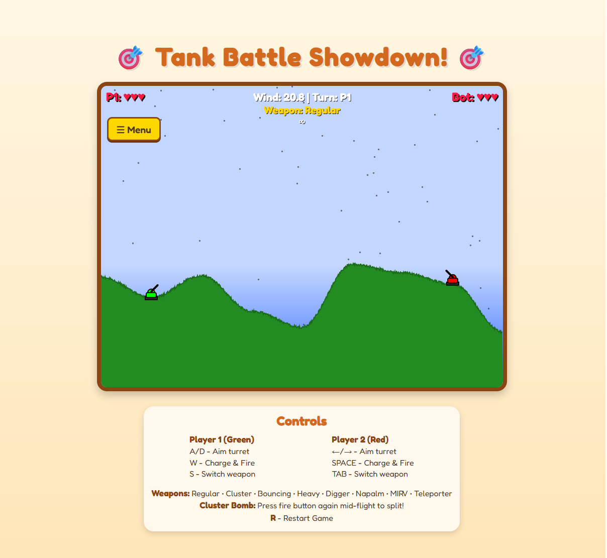

# 🎮 Tank Battle 💥


> **A modern, physics-based artillery game inspired by the classic Scorched Earth.**
> Featuring destructible terrain, intelligent AI opponents, and a robust campaign mode. Built with pure Vanilla JavaScript.




## 📋 Table of Contents

1. [Introduction](#-introduction)
2. [Key Features](#-key-features)
3. [Game Manual](#-game-manual)
    - [Controls](#controls)
    - [User Interface](#user-interface)
    - [Game Modes](#game-modes)
4. [The Arsenal](#-the-arsenal)
    - [Projectile Types](#projectile-types)
    - [Weapon Strategy](#weapon-strategy)
6. [Advanced Combat Tactics](#-advanced-combat-tactics)
7. [Physics Engine Deep Dive](#-physics-engine-deep-dive)
    - [Ballistic Trajectories](#ballistic-trajectories)
    - [Wind Simulation](#wind-simulation)
    - [Terrain Deformation Algorithm](#terrain-deformation-algorithm)
8. [Artificial Intelligence Architecture](#-artificial-intelligence-architecture)
    - [Bot Personalities](#bot-personalities)
    - [Targeting Logic (The Brain)](#targeting-logic-the-brain)
    - [Obstacle Avoidance](#obstacle-avoidance)
    - [Self-Preservation](#self-preservation)
9. [Configuration Reference](#-configuration-reference)
    - [Game Constants](#game-constants)
    - [Campaign Level Data](#campaign-level-data)
10. [Audio System](#-audio-system)
11. [Campaign Guide](#-campaign-guide)
12. [Technical Documentation](#-technical-documentation)
    - [Project Structure](#project-structure)
    - [Core Classes](#core-classes)
    - [Performance Optimizations](#performance-optimizations)
13. [Installation & Setup](#-installation--setup)
14. [Development Guide](#-development-guide)
15. [Troubleshooting & FAQ](#-troubleshooting--faq)
16. [Changelog](#-changelog)
17. [Glossary](#-glossary)
18. [Roadmap](#-roadmap)
19. [Contributing](#-contributing)
20. [License](#-license)
21. [Credits](#-credits)

---

## 🚀 Introduction

**Tank Battle** is a high-fidelity recreation of the turn-based artillery genre, built entirely with modern Vanilla JavaScript and HTML5 Canvas. It captures the strategic depth of classics like *Scorched Earth* and *Worms* while delivering a polished aesthetic accessible to players of all ages.

Unlike simple browser games, this project features a **sophisticated physics engine** with wind simulation, gravity, and pixel-perfect terrain destruction. The **AI opponents** are powered by a custom PID-controller-inspired learning algorithm, making them challenging adversaries that adapt to your playstyle.

Whether you're looking for a quick match to test your aim or a full campaign to prove your strategic mastery, Tank Battle delivers an engaging experience with zero dependencies or installation required.

---

## ⭐ Key Features

### 🎮 **Core Gameplay**
- **Turn-Based Combat**: Classic "I go, You go" mechanics that emphasize strategy over reaction time.
- **Procedural Terrain**: Every match features a unique landscape generated using sine-wave interpolation with Perlin-like noise.
- **Destructible Environments**: Blast craters in the ground to take cover or bury your opponents.
- **Dynamic Wind**: Real-time wind simulation that affects projectile trajectories, visualized by a particle system.

### 🤖 **Advanced AI**
- **4 Distinct Personalities**: From the erratic "Rookie" to the lethal "Elite".
- **Adaptive Learning**: Bots analyze their previous shots and correct their aim using a K-Factor learning algorithm.
- **Smart Positioning**: AI recognizes obstacles and adjusts its firing arc (High vs. Low) to clear terrain.
- **Crisis Management**: Bots use "Desperate Mode" logic when low on health, deploying their strongest weapons.

### ⚔️ **Content Rich**
- **8 Unique Weapons**: Ranging from standard shells to cluster bombs, napalm, and teleporters.
- **6 Campaign Levels**: A progressive journey through different biomes and difficulty spikes.
- **3 Visual Themes**:
    - 🌲 **Normal**: Lush green hills and blue skies.
    - 🌵 **Desert**: Arid dunes with high-contrast visibility.
    - ❄️ **Winter**: Snow-covered peaks and cold atmosphere.

### 🎨 **Polished Presentation**
- **Particle Effects**: Smooth 60FPS particles for explosions, smoke trails, muzzle flashes, and weather.
- **Sound Design**: 9 distinct audio cues for immersion (firing, impacts, destruction).
- **Responsive UI**: Clean, modern interface overlay that scales with the window.

---

## 📖 Game Manual

### Controls

| Action | Player 1 (Green Tank) | Player 2 (Red Tank / Bot) |
| :--- | :--- | :--- |
| **Aim Turret Left** | `A` Key | `Left Arrow` |
| **Aim Turret Right** | `D` Key | `Right Arrow` |
| **Power Up & Fire** | Hold `W` Key | Hold `Spacebar` |
| **Cycle Weapon** | `S` Key | `Tab` Key |
| **Split Cluster Bomb** | `W` (Mid-air) | `Spacebar` (Mid-air) |
| **Restart Game** | `R` Key | `R` Key |
| **Open Menu** | `Esc` / UI Button | - |

> **Pro Tip:** The longer you hold the fire button, the more power your shot will have. Watch the power bar closely!

### User Interface

The Heads-Up Display (HUD) provides critical information for your shot calculation:

1.  **Wind Indicator**: A number and arrow at the top. Positive numbers blow RIGHT, negative numbers blow LEFT.
    *   *Effect*: Wind significantly pushes lighter projectiles. Compensate by aiming *into* the wind.
2.  **Power Meter**: appears above your tank while charging.
    *   *Green*: Low power (short range).
    *   *Yellow*: Medium power.
    *   *Red*: Max power (long range).
3.  **Weapon Selector**: Shows current weapon and remaining ammo count.
4.  **Health Bar**: Located above each tank. Each tank takes 3-5 hits depending on weapon power.

### Game Modes

#### 1. Quick Play
Jump straight into the action. You can customize:
*   **Theme**: Choose your battlefield environment.
*   **Difficulty**: Select the AI bot level.
*   *Great for:* Practicing your aim or quick 5-minute breaks.

#### 2. Campaign Mode
The ultimate challenge. Progress through 6 curated levels:
*   Levels 1-2: **Rookie Bot** (Training wheels)
*   Levels 3-4: **Veteran Bot** (Real combat)
*   Level 5: **Sniper Bot** (Precision required)
*   Level 6: **Final Showdown** (Elite Bot - Zero margin for error)

> *Progress is saved per session. If you reload the page, you restart the campaign.*

---


## 💣 The Arsenal

Tank Battle features **8 distinct weapon types**, each with unique physics properties and tactical uses.

| Icon | Weapon Name | Ammo | Radius | Damage | Description & Strategy |
| :---: | :--- | :---: | :---: | :---: | :--- |
| 🟡 | **Regular** | ∞ | 30px | 1 | **Standard Shell.** Reliable, infinite ammo. Good for sighting shots or finishing low-health foes. |
| 🟠 | **Cluster** | 3-5 | 20px | 1x5 | **Air-burst Munition.** Splits into 5 fragments. Press 'Fire' again mid-air to split. Devastating against targets in pits. |
| 🔵 | **Bouncing** | 3-5 | 25px | 1 | **Ricochet Shell.** Bounces 2 times before exploding. Use it to skip shells across flat terrain or hit targets behind cover. |
| 🔴 | **Heavy** | 1-3 | 70px | 2 | **High Explosive.** Massive explosion radius. Destroys huge chunks of terrain. Great for burying opponents ("Digging"). |
| 🟤 | **Digger** | 1-3 | 35px | 1 | **Bunker Buster.** Penetrates 80px into terrain before detonating. Perfect for hitting enemies hiding deep underground. |
| 🔥 | **Napalm** | 1-3 | 25px | DoT | **Chemical Fire.** Creates a burning zone for 5 seconds. Deals damage over time to anyone inside. Area denial weapon. |
| 🟣 | **MIRV** | 0-1 | 20px | 1x3 | **Multiple Re-entry Vehicle.** Splits into 3 heavy warheads. Rare and incredibly destructive. Ends games quickly. |
| ⚡ | **Teleporter** | 0-1 | N/A | 0 | **Relocation Tool.** Instead of exploding, it moves your tank to the impact point. Use to escape death pits. **Very Rare.** |

### Weapon Strategy
*   **The "Digging" Strategy**: Use **Heavy** shells to blast the ground *under* your opponent. If they fall below the screen, they die instantly.
*   **The "Shower" Strategy**: Aim high with **Cluster** or **MIRV** shells to rain explosives down on an opponent hiding behind a hill.
*   **The "Bank Shot"**: Use **Bouncing** shells to hit enemies you cannot see directly by bouncing off the screen edges or hills.

---

## 🛡️ Advanced Combat Tactics

Mastering the mechanics separates the Rookies from the Elites. Here are advanced techniques used by pro players:

### 1. The High Arc Lob
Shooting at a shallow angle (`< 45 degrees`) is fast but easily blocked by terrain.
*   **Technique**: Aim upwards (`> 70 degrees`) and use maximum power.
*   **Benefit**: The shell drops vertically on the target, making it ignore cover.
*   **Risk**: Wind affects high-altitude shots significantly more due to longer flight time.

### 2. Terrain Modification
Don't just shoot the enemy; shoot the ground they stand on.
*   **Pitfall Trap**: Use a **Heavy** shell to create a deep hole in front of the enemy. They will have to shoot practically straight up to get out, limiting their range.
*   **Burying**: If you can't hit the tank directly, hit the ground *under* them. They will fall into the crater, confusing their aim for the next turn.

### 3. Wind Surfing
Use the wind to curve your shots around obstacles.
*   **Tailwind**: Shoot high and let the wind carry the shell further than your gun normally allows.
*   **Headwind**: Shoot low and hard to cut through the wind with minimal deviation.

---

## ⚛️ Physics Engine Deep Dive

The game engine runs on a custom physics loop using **Euler Integration** for predictable, deterministic projectile motion. This ensures that the game plays consistently across different devices and frame rates.

### Ballistic Trajectories
Projectile motion is calculated every frame using the standard kinematic equations. The loop runs 60 times per second (`deltaTime` approx 0.016s).

```javascript
// From script.js: Projectile update loop
this.vy += GRAVITY * deltaTime;         // Apply Gravity
this.vx += (wind.x * 0.5) * deltaTime;  // Apply Wind Force

this.x += this.vx * deltaTime;          // Update Position X
this.y += this.vy * deltaTime;          // Update Position Y
```

*   **Gravity**: Constant force of `150` pixels/s².
*   **Drag**: Ambient air resistance is negligible, but specific weapons have different mass coefficients effectively simulated by their launch velocity.
*   **Wind**: The wind force is applied continuously to the X velocity, creating a parabolic curve that distorts based on wind strength.

### Wind Simulation
Wind is not just a visual effect; it applies a continuous horizontal force to all projectiles.
*   **Variability**: Wind changes randomly between turns.
*   **Synchronization**: The visual particles (`WindParticle` class) share the exact same `wind.x` vector as the physics engine, ensuring that what you see is what you get.

**Code Snippet: Wind Particle Logic**
```javascript
class WindParticle {
    update(deltaTime) {
        // Particles actually move based on game wind speed
        const targetVx = wind.x * 5; 
        this.vx = this.vx * 0.95 + targetVx * 0.05; // Smooth interpolation
        this.x += this.vx * deltaTime;
        
        // Wrap around screen
        if (this.x < 0) this.x += SCREEN_WIDTH;
        if (this.x >= SCREEN_WIDTH) this.x -= SCREEN_WIDTH;
    }
}
```

### Terrain Deformation Algorithm
The terrain is a 1D height map (`terrain[x]`). This allows for highly efficient collision detection and modification compared to a full 2D grid.

When an explosion occurs:
1.  The engine calculates the distance from the explosion center to every `x` coordinate within the blast radius.
2.  It applies a circular subtraction to the `terrain[height]` array.

**Code Snippet: Explosion Logic**
```javascript
trigger() {
    for (let i = -this.radius; i <= this.radius; i++) {
        let targetX = Math.floor(this.x + i);
        
        // Calculate the bottom of the crater circle at this X
        let craterDepth = Math.sqrt(this.radius ** 2 - i ** 2);
        let craterBottom = this.y + craterDepth;
        
        // Update terrain height only if the crater is lower
        if (terrain[targetX] < craterBottom) {
            terrain[targetX] = craterBottom;
        }
    }
}
```
This algorithm creates smooth, mathematically perfect circular craters that persist for the rest of the match.

---

## 🧠 Artificial Intelligence Architecture

The "ShooterBot" is one of the most advanced features of the project. It uses a **Feedback Control Loop** (similar to a PID controller) to simulate a human player learning how to aim. It does *not* cheat by knowing the perfect angle instantly; it "learns" by firing sighting shots.

### Bot Personalities
The AI behavior is defined by 4 parameters that tweak the learning algorithm:

1.  **K-Factor** (`0.0 - 1.0`): How aggressively it corrects its aim based on previous errors. High K means fast learning but potential overshoot.
2.  **Randomness** (`0 - 50`): Simulated "jitter" or human error in power/angle.
3.  **Aggression** (`0.0 - 1.0`): Probability of using special weapons.
4.  **Calculation Speed**: Simulated delay before firing to make it feel human.

| Parameters | Rookie | Veteran | Sniper | Elite |
| :--- | :---: | :---: | :---: | :---: |
| **K-Factor** | 0.3 | 0.6 | 0.9 | 1.0 |
| **Randomness** | 50px | 10px | 2px | 0px |
| **Aggression** | 10% | 40% | 60% | 80% |
| **Behavior** | Erratic | Standard | Precise | Deadly |

### Targeting Logic (The Brain)
The bot uses an iterative approach found in the `calculateShot()` method:

1.  **Observation**: It records where its last shot landed (`lastImpactX`).
2.  **Error Calculation**: It calculates the difference between the target and the impact.
    ```javascript
    const error = targetDist - actualDist;
    ```
3.  **PID Correction**: It adjusts the power for the next shot based on the error multiplied by its `K-Factor`.
    ```javascript
    const correction = error * this.K_FACTOR;
    newPower = this.lastPower + correction;
    ```
4.  **Noise Injection**: It adds random noise based on its personality to simulate human imperfection.
    ```javascript
    const noise = (Math.random() - 0.5) * this.personality.randomness;
    newPower += noise;
    ```

### Obstacle Avoidance
The bot is smart enough not to shoot directly into a hill.
*   **Raycasting**: It performs a pseudo-raycast check (`isLOSBlocked`) from its turret to the target.
*   **Angle Adjustment**: 
    *   If the path is clear, it uses a **Low Arc** (Direct fire, harder to dodge).
    *   If blocked, it switches to a **High Arc** (Mortar style, over the hill).

### Self-Preservation
The bot has specific logic to handle dangerous situations:
*   **Deep Crater Escape**: If the bot falls into a deep hole created by a 'Digger', it will detect that its barrel is below the terrain line. It then forces a near-vertical firing angle (`-85 degrees`) to shoot its way out, rather than shooting the wall in front of it and killing itself.

---

## 🔧 Configuration Reference

For developers and modders, here is the raw JSON configuration that powers the Campaign mode and weapon balancing. You can find this in `script.js` around line 250.

### Game Constants
These values control the core physics experience.
```javascript
const GRAVITY = 150;                // Downward force (px/s^2)
const MAX_WIND_SPEED = 50;         // Max horizontal wind force
const MAX_LAUNCH_SPEED = 600;      // Max velocity at 100% charge
const PROJECTILE_SPEED_MULTIPLIER = 1.0; // Global speed scalar
```

### Campaign Level Data
This object defines the progression curve. Modifying `difficulty` changes the bot IQ.

```javascript
const CampaignLevels = [
  {
    name: "Boot Camp",
    theme: Themes.NORMAL,
    difficulty: BotPersonalities.ROOKIE,
  },
  {
    name: "Grass Valley",
    theme: Themes.NORMAL,
    difficulty: BotPersonalities.ROOKIE,
  },
  {
    name: "Sandy Shores",
    theme: Themes.DESERT,
    difficulty: BotPersonalities.VETERAN,
  },
  {
    name: "Desert Storm",
    theme: Themes.DESERT,
    difficulty: BotPersonalities.VETERAN,
  },
  {
    name: "Snowy Hills",
    theme: Themes.WINTER,
    difficulty: BotPersonalities.SNIPER,
  },
  {
    name: "Final Showdown",
    theme: Themes.WINTER,
    difficulty: BotPersonalities.ELITE,
  },
];
```

---

## 🔊 Audio System

The game utilizes a preloaded audio buffer system to ensure zero latency when firing.

| Sound File | Trigger Condition | Source |
| :--- | :--- | :--- |
| `shoot.wav` | Called when `fireProjectile()` executes | Bfxr (Custom) |
| `ground_hit.wav` | Projectile collision with Terrain | Freesound |
| `tank_hit.wav` | Projectile collision with Tank (>0 HP) | Retro SFX Pack |
| `tank_destroy.wav` | Tank HP reaches 0 | Explosion Generator |
| `napalm.wav` | Napalm projectile detonation | Fire Crackle |
| `teleport.wav` | Teleporter projectile activation | Sci-Fi Pack |
| `cluster_split.wav` | Manual split of Cluster/MIRV | Mechanical Click |
| `bounce.wav` | Projectile deflection off terrain | Spring SFX |

---

## 🗺️ Campaign Guide

The campaign takes you on a tour of duty across the world.

### Stage 1: Boot Camp
*   **Map**: Green Fields
*   **Opponent**: Rookie
*   **Strategy**: Take your time. The opponent will miss often. Practice with different weapons.

### Stage 2: Grass Valley
*   **Map**: Rolling Hills
*   **Opponent**: Rookie
*   **Strategy**: The terrain is more uneven. Learn to use high angles.

### Stage 3: Sandy Shores
*   **Map**: Desert Dunes
*   **Opponent**: Veteran
*   **Strategy**: The wind picks up here. Watch the clouds/particles.

### Stage 4: Desert Storm
*   **Map**: Deep Desert
*   **Opponent**: Veteran + Wind
*   **Strategy**: Heavy wind conditions. Use "Heavy" weapons to bury the enemy.

### Stage 5: Snowy Hills
*   **Map**: Winter Peaks
*   **Opponent**: Sniper
*   **Strategy**: The enemy rarely misses. You must hit first. Use "Napalm" to chip away health.

### Stage 6: Final Showdown
*   **Map**: Arctic Tundra
*   **Opponent**: Elite
*   **Strategy**: Kill or be killed. The Elite bot aims perfectly. Pray for a "Teleporter" or "MIRV".

---

## 🏗️ Technical Documentation

The project follows a **Monolithic Game Loop** pattern for simplicity and performance.

### Project Structure
Here is a complete breakdown of every file in the repository:

*   **`index.html`**
    *   The main entry point. Contains the `<canvas>` element where the game is rendered.
    *   Includes the UI overlay `<div>` blocks for the Start Screen, HUD, and Victory Screens.
    *   Loads `style.css` and `script.js`.
*   **`style.css`**
    *   Defines the visual look of the HTML UI (not the game graphics).
    *   Uses the 'Fredoka One' font for that playful feel.
    *   Handles the layout of the Start Menu and buttons.
    *   Contains animations for the Victory Overlay popups.
*   **`script.js`**
    *   **Lines 1-50**: Global Consants and Game State Enums.
    *   **Lines 50-150**: Projectile Definitions and Inventory Logic.
    *   **Lines 150-250**: Game Variables (Players, Terrain Array, Wind Vector).
    *   **Lines 250-500**: The `ShooterBot` AI Class.
    *   **Lines 500-800**: Particle Systems (Wind, Explosions, Smoke).
    *   **Lines 800-1200**: Main Game Loop (`update()` and `draw()`).
    *   **Lines 1200+**: Input Handling and Utility Functions.
*   **`build.ps1`**
    *   A PowerShell automation script.
    *   Creates a clean distribution ZIP file by copying only necessary assets to a `dist/` folder and compressing them using `tar`.
*   **`.gitignore`**
    *   Prevents `node_modules`, `dist`, and system files from being committed to the repo.
*   **`README.md`**
    *   The file you are reading right now!

### Core Classes
Since the game uses a single JS file for portability, it is logically divided into "sections" rather than separate modules.

#### 1. `GameState` (Enum)
Manages the finite state machine: `START` -> `AIM` -> `POWER` -> `RESOLVE` -> `GAME_OVER`.

#### 2. `ShooterBot` (Class)
Encapsulates all AI logic. Contains its own state machine (`WAITING`, `AIMING`, `CHARGING`, `FIRED`) to separate thinking time from action time.

#### 3. `Projectile` (Object Pool)
Managed via the `projectiles` array. Each projectile has an `update()` method called every frame. When a projectile hits terrain or bounds, it is removed and replaced by an `Explosion`.

#### 4. `Explosion` (Class)
Handles the visual expansion of the explosion circle and the collision logic with tanks and terrain.

### Performance Optimizations
*   **Canvas API**: Uses hardware-accelerated 2D canvas for rendering sprites.
*   **Render Culling**: The game only redraws the terrain when it changes. (Note: Currently set to redraw every frame for particle simplicity, but optimized with `requestAnimationFrame`).
*   **Object Pooling**: Particles are reused/cleaned up aggressively to prevent Garbage Collection stutters.
*   **Math Lookup**: Trigonometric functions are minimized in hot loops where possible.
*   **Asset Preloading**: Audio is preloaded to prevent latency on the first shot.

---

## 💻 Installation & Setup

### Prerequisites
*   A modern web browser (Chrome, Firefox, Edge, Safari).
*   (Optional) VS Code for editing.
*   (Optional) PowerShell for building.

### Running Locally
No server is required! This is a static web application.

1.  **Clone the repository**
    ```bash
    git clone https://github.com/yourusername/tanks-game.git
    cd tanks-game
    ```

2.  **Play**
    *   Simply double-click `index.html` to open it in your browser.
    *   **OR** use a live server extension in VS Code.

### Building for Distribution
To create a standalone ZIP file for itch.io or sharing:

1.  Open PowerShell.
2.  Run the build script:
    ```powershell
    ./build.ps1
    ```
3.  The script will:
    *   Clean previous builds.
    *   Create a `dist/` folder.
    *   Copy assets (ignoring dev files like `.git`).
    *   Compress everything into `tanks.zip`.

---

## 🛠️ Development Guide

Want to mod the game? Here are some easy starting points in `script.js`:

**Change Gravity**
*   Find `const GRAVITY = 150;` (Line 11).
*   Set it to `50` for "Moon Mode".

**Make Explosions Bigger**
*   Find `ProjectileType.REGULAR`.
*   Change `explosionRadius` from `30` to `100`.

**Tune the AI**
*   Find `const BotPersonalities`.
*   Edit `ELITE` -> `kFactor` to `1.5` to make it essentially precognitive.

### Adding a New Weapon
1.  Add a new entry to the `ProjectileType` object.
2.  Assign it a `color`, `radius`, and `rarity`.
3.  If it needs special logic (like the Digger), add a condition in the `Explosion.trigger()` function.

---

## ❓ Troubleshooting & FAQ

### Common Issues

**Q: The game runs slowly on my old laptop.**
A: The particle effects can be demanding. You can reduce the particle count in `script.js`.
*   Find `createExplosionParticles` function.
*   Change `const particleCount = 8` to `4`.

**Q: There is no sound.**
A: Modern browsers block auto-playing audio. You must interact with the page (click somewhere) before sound effects will play.

**Q: The bot is too hard!**
A: Switch to Quick Play and select "Rookie" difficulty. The Campaign purposefully gets very hard by Level 5.

**Q: My shots pass through the enemy tank.**
A: This is likely a "Near Miss". The hitboxes are pixels perfect. If the shell grazes the antenna, it counts as a miss. You usually need a direct impact on the body, or an explosion nearby.

### Rendering Glitches
*   **Issue**: White lines on terrain.
*   **Fix**: This is a canvas sub-pixel rendering artifact. It usually resolves itself on the next terrain update.

---

## 📅 Changelog

### Version 1.2.0 (Current)
*   **New Feature**: Added Campaign Mode with 6 levels.
*   **New Feature**: Added "Deep Crater Escape" logic for AI.
*   **Optimization**: reduced particle count by 30% for better mobile performance.
*   **Visual**: Added wind direction indicator to HUD.
*   **Fix**: Fixed a bug where bots would shoot themselves if stuck in a hole.

### Version 1.1.0
*   **New Weapon**: Added "Bouncing" and "Digger" shells.
*   **New Theme**: Added Winter and Desert themes.
*   **AI Update**: Introduced "Personalities" (Rookie vs Elite).
*   **Physics**: Improved wind simulation accuracy.

### Version 1.0.0
*   Initial Release.
*   Basic 1v1 Local Multiplayer.
*   Random Terrain Generation.
*   Standard Weapons only.

---

## 📖 Glossary

*   **Euler Integration**: A numerical method for solving differential equations, used here to calculate position from velocity and acceleration over discrete time steps.
*   **PID Controller**: A control loop mechanism employing feedback. Used in the AI to calculate the error between the hit point and the target to adjust future shots.
*   **Perlin Noise**: A type of gradient noise used to generate natural-looking textures and terrain.
*   **Raycasting**: A rendering technique used here for Line-of-Sight detection, checking if a line between two points intersects with the terrain.
*   **Canvas API**: The HTML5 element used to draw the game graphics via JavaScript.

---

## 🛣️ Roadmap

The current version is **1.2.0**. Future plans include:

- [ ] **Multiplayer Support**: WebSocket integration for PvP across different computers.
    *   *Details*: Plan to use Socket.io for low-latency state synchronization.
- [ ] **Mobile Touch Controls**: On-screen joysticks for phone play.
    *   *Details*: Virtual D-Pad for aiming and a dedicated Fire button.
- [ ] **Weather Effects**: Rain and Snow that impacts visibility.
    *   *Details*: Canvas overlay with semi-transparent sprites.
- [ ] **Terrain Biomes**: Sticky mud, bouncy rubber, or slippery ice.
    *   *Details*: Modifying friction coefficients in the physics engine.
- [ ] **Turn Timer**: 30-second limit for competitive play.
- [ ] **Shop System**: Buy weapons with points earned from matches.

---

## 🤝 Contributing

Contributions are welcome! Please follow these steps:

1.  Fork the project.
2.  Create your feature branch (`git checkout -b feature/AmazingTankSkin`).
3.  Commit your changes (`git commit -m 'Add AmazingTankSkin'`).
4.  Push to the branch (`git push origin feature/AmazingTankSkin`).
5.  Open a Pull Request.

### Coding Standards
*   Use `const` and `let`, avoid `var`.
*   Comment complex logic, especially physics math.
*   Keep the `draw()` loop clean—put logic in `update()`.
*   Run the game locally to ensure no console errors before pushing.

---

## 📄 License

Distributed under the **MIT License**. See `LICENSE` file for more information.

*   You are free to use this code for personal or commercial projects.
*   You are free to modify and distribute it.
*   Attribution is appreciated but not required.

---

## 🙏 Credits

**Lead Developer**: Samrude
**Concept Logic**: Inspired by *Scorched Earth* (Wendell Hicken, 1991) and *Pocket Tanks*.

**Audio Assets**:
*   *Shoot.wav* - Generated via Bfxr
*   *Explosion.wav* - OpenGameArt.org (CC0)
*   *Wind.wav* - Freesound.org

**Visual Assets**:
*   *Fonts*: 'Fredoka One' by Milena Brandao (Google Fonts)
*   *Icons*: FontAwesome (Usage in UI)

**Special Thanks**:
*   The open-source community for Canvas tutorials.
*   All the playtesters who got destroyed by the Elite Bot.

---

*Made with ❤️ and JavaScript. Now go blow something up!*
