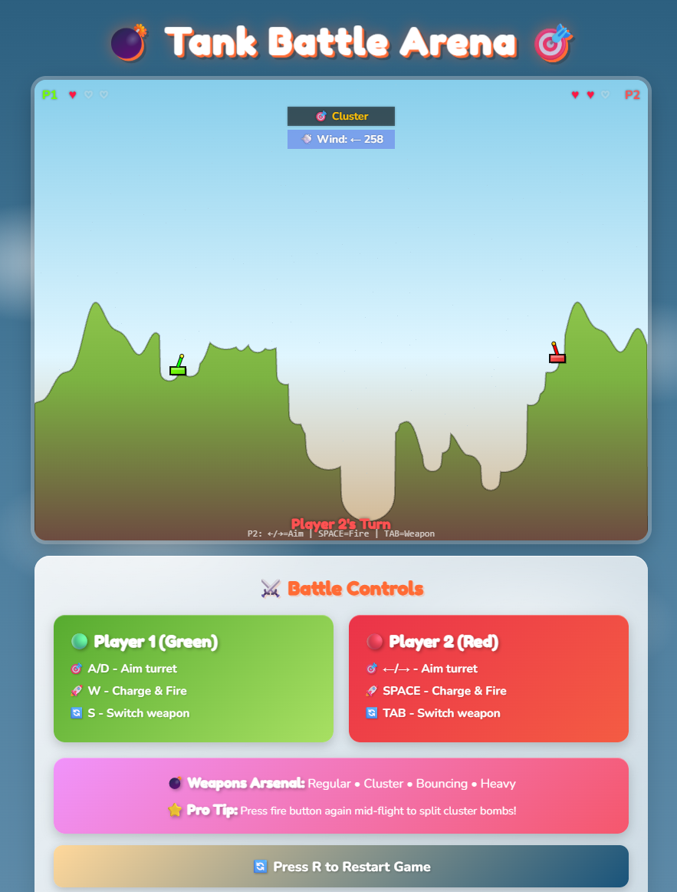

# Tank Battle Cartoon! 🎮💥

A modern recreation of the classic Scorched Earth artillery game with enhanced physics, AI bot opponents, campaign mode, multiple weapon types, and stunning cartoon-style visuals.



## 🎯 Features

### Core Gameplay
- **Player vs AI Bot** - Battle against intelligent AI opponents with 4 difficulty levels
- **Campaign Mode** - Progress through 6 challenging levels with increasing difficulty
- **Quick Play Mode** - Instant action with customizable themes and difficulty
- **Realistic Physics** - Gravity, wind, and ballistic trajectories
- **Dynamic Terrain** - Procedurally generated landscapes with destruction
- **8 Unique Weapon Types** - Each with distinct visuals and mechanics

### Game Modes
- **Quick Play** - Choose your theme (Normal, Desert, Winter) and bot difficulty
- **Campaign** - Fight through 6 levels from Boot Camp to Final Showdown

### AI Bot System
- **Rookie** - Learning the ropes (30% accuracy, high randomness)
- **Veteran** - Experienced fighter (60% accuracy, moderate randomness)
- **Sniper** - Precision shooter (90% accuracy, minimal randomness)
- **Elite** - Master tactician (100% accuracy, perfect shots)

### Weapons Arsenal
1. **Regular** - Standard projectile with medium explosion (Infinite ammo)
2. **Cluster** - Splits into 5 smaller projectiles (3-5 shots)
3. **Bouncing** - Bounces off terrain before exploding (3-5 shots)
4. **Heavy** - Massive explosion radius (1-3 shots)
5. **Digger** - Penetrates terrain before exploding (1-3 shots)
6. **Napalm** - Creates burning damage zone (1-3 shots)
7. **MIRV** - Multiple independently targeted warheads (0-1 shots)
8. **Teleporter** - Instantly relocate your tank (0-1 shots, rare)

### Visual Effects
- **Cartoon Art Style** - Vibrant colors, bold outlines, playful aesthetics
- **Unique Projectile Visuals** - Each weapon has distinct animated appearance
- **Particle Systems** - Explosions, debris, smoke, and muzzle flashes
- **Wind Visualization** - 80 particles showing wind direction and strength
- **Theme Variations** - Normal (green grass), Desert (sandy), Winter (snowy)
- **Smooth Animations** - 60 FPS gameplay with optimized rendering

## 🎮 Controls

### Player 1 (Green Tank)
- **A/D** - Aim turret left/right
- **W** - Hold to charge power, release to fire
- **S** - Cycle through available weapons
- **W (mid-flight)** - Split cluster bombs manually

### General
- **R** - Restart game
- **☰ Menu** - Return to main menu (during game)

## 🛠️ Technical Architecture

### Code Structure
The game is contained in a single optimized `script.js` file for easy deployment and local play without needing a server.


### Physics System
- Delta-time based physics for consistent gameplay across devices
- Wind affects projectiles with realistic horizontal force
- Gravity simulation with proper ballistic trajectories
- Collision detection with terrain and tanks
- Terrain deformation with circular crater generation

### AI Bot Intelligence
- **Learning System** - Bot improves aim based on previous shot impacts
- **Obstacle Detection** - Adjusts trajectory to clear terrain obstacles
- **Crater Escape** - Special logic to escape deep craters
- **Weapon Selection** - Strategic weapon choice based on situation
- **Personality System** - Different K-factors and randomness per difficulty

### Performance Optimizations
- Reduced particle counts (80 wind particles, 8 explosion particles)
- Optimized trail rendering (10 points max)
- Efficient collision detection
- Canvas-based rendering with minimal redraws
- Module caching for faster load times

## 🚀 Installation & Running

### Quick Start
Simply open `index.html` in any modern web browser to play! No installation or server required.


## 📁 File Structure

```
tanks/
├── index.html              # Main HTML file
├── style.css              # Cartoon-style CSS
├── script.js              # Main game code
├── README.md              # This file
├── screenshot.png         # Game screenshot
├── .gitignore            # Git ignore rules
└── sounds/               # Sound effects (9 files)
    ├── shoot.wav
    ├── ground_hit.wav
    ├── tank_hit.wav
    ├── tank_destroy.wav
    ├── napalm.wav
    └── teleport.wav
```

## 🎨 Themes

### Normal Theme
- Sky: Bright blue gradient
- Ground: Vibrant green grass
- Atmosphere: Classic battlefield

### Desert Theme
- Sky: Light blue to white gradient
- Ground: Sandy tan terrain
- Atmosphere: Hot and arid

### Winter Theme
- Sky: Pale cyan gradient
- Ground: Snow white terrain
- Atmosphere: Cold and crisp

## 🤖 Bot AI Features

### Intelligent Targeting
- Calculates optimal angle based on distance and obstacles
- Adjusts for wind conditions
- Learns from previous shot impacts
- Uses iterative correction with K-factor learning

### Strategic Weapon Selection
- **Desperate Mode** - Uses powerful weapons when health is low
- **Aggression System** - Higher difficulties use special weapons more often
- **Easter Egg** - 1% chance to use Teleporter if available
- **Tactical Choice** - Selects weapons based on situation

### Obstacle Handling
- Line-of-sight detection
- High arc trajectory for blocked shots
- Crater depth detection and escape logic
- Adaptive power adjustment

## 🎯 Campaign Levels

1. **Boot Camp** (Rookie) - Normal theme, easy start
2. **Grass Valley** (Rookie) - Normal theme, learning continues
3. **Sandy Shores** (Veteran) - Desert theme, difficulty increases
4. **Desert Storm** (Veteran) - Desert theme, tactical challenge
5. **Snowy Hills** (Sniper) - Winter theme, precision required
6. **Final Showdown** (Elite) - Winter theme, ultimate test

## 🔧 Configuration

Key constants in `js/constants.js`:

```javascript
const GRAVITY = 150;                // Physics gravity
const MAX_WIND_SPEED = 50;         // Maximum wind strength
const MAX_LAUNCH_SPEED = 600;      // Maximum shot power
const MAX_CHARGE_TIME = 2000;      // Power charge time (ms)
```

## 🎵 Sound Effects

The game includes 6 sound effects:
- Shoot - Projectile firing
- Ground Hit - Terrain impact
- Tank Hit - Tank damage
- Tank Destroy - Tank destruction
- Napalm - Fire weapon activation
- Teleport - Teleporter activation

## 📊 Game Statistics

- **Code Lines**: ~1,900 (split across 13 modules)
- **Projectile Types**: 8 unique weapons
- **AI Personalities**: 4 difficulty levels
- **Campaign Levels**: 6 progressive challenges
- **Themes**: 3 visual environments
- **Particle Systems**: Wind, explosions, debris, smoke, napalm

## 🐛 Known Issues

- Bot may occasionally overshoot in deep craters (learning system compensates)

## 🚀 Future Enhancements

- [ ] Multiplayer over network
- [ ] More campaign levels
- [ ] Additional weapon types
- [ ] Power-ups and pickups
- [ ] Destructible structures
- [ ] Weather effects
- [ ] Replay system
- [ ] Leaderboards

## 📝 Development Notes

### Recent Refactoring (2025-11-29)
- Optimized `script.js` for performance and readability
- Enhanced particle systems
- Improved AI logic

### Performance Optimizations
- Particle count reduced from 100 to 80 (wind)
- Trail length reduced from 20 to 10 points
- Explosion particles reduced from 10 to 8
- Efficient module loading and caching

## 🙏 Credits

- Inspired by **Scorched Earth** (1991) by Wendell Hicken
- Modern recreation with enhanced features and AI
- Cartoon art style for family-friendly appeal

## 📄 License

MIT License - Feel free to use, modify, and distribute!

## 🎮 Quick Tips

1. **Wind Matters** - Watch the wind indicator and adjust your aim
2. **Power Control** - Longer charge = more power, but harder to control
3. **Weapon Strategy** - Save special weapons for critical moments
4. **Terrain Use** - Use hills for cover and high-arc shots
5. **Bot Learning** - The bot learns from each shot, adapt your strategy!

---

**Enjoy the battle! 🎮💥**
